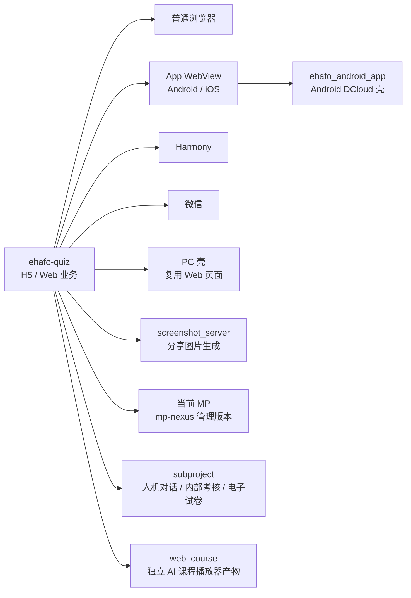

# 易哈佛前台：项目概况

## 项目定位

易哈佛前台是需要优先掌握的核心逻辑项目。主要业务实现位于 `ehafo-quiz`，同一套 H5/Web 业务运行在普通浏览器、Android 与 iOS App WebView、Harmony、微信和 PC 壳中；当前 MP、由早期 MP 演化出的 subproject、独立 AI 课程播放器产物、Android 壳、分享图片服务和 PC 打包仓承担各自的关联职责。

## 项目关注点

- 根据部署环境和运行载体找到正确入口、构建产物与验证方式。
- 业务与接口变更如何兼容各端及旧版 App。
- 用户疑难问题如何结合现场信息、线上异常日志和设备调试定位。
- A/B 如何放量、观察和彻底收口。
- 离线媒体、弱网、网关切换、WebView 生命周期等跨端问题如何判断。
- 页面改动如何按 Playwright、微信开发者工具、ADB 三层测试，并对做题、支付、分享等关键链路完成人工验收。

## 组成关系

这里先区分两个不能混淆的维度：

- **部署环境**：本地、DEV、preview、hotfix、release。
- **运行载体**：浏览器、App WebView、Harmony、微信和 PC 壳，对应不同入口文件。

测试与排查手段不属于项目组成或运行环境，统一放在问题排查和验收页面说明。

## 运行环境与入口

以下是从 `ehafo-quiz` 当前源码、构建配置和项目说明中核对出的技术环境。它说明代码如何识别和构建环境，不代表某次发布已经成功；验收时仍要核对实际入口、资源哈希和运行版本。

| 环境 | 用途 | 主要入口 | 构建形态 |
| --- | --- | --- | --- |
| 本地联调 | 本机开发与前后端联调 | `https://quiz-local.dev.ehafo.com/entry.html` | `scripts/dev.sh up` 准备本地域名；前台走 `build:dev` |
| DEV | 日常测试 | `https://quiz.dev.yiqizuoti.com/entry.html` | `build:dev`，资源按文件展开 |
| preview | 验收 App、微信和 Harmony 渠道产物 | `https://tiku-v5.dev.yihafo.com/entry.<载体>.html` | CI `build:v52`，内容哈希产物 |
| hotfix | 修复环境验证 | 同 preview 域名，入口为 `entry-<载体>-hotfix.html` | CI `build:v52`，内容哈希产物 |
| release | 线上环境 | Web 为 `https://quiz.yiqizuoti.com/entry.html`；各渠道使用对应线上入口 | Web 仍为展开构建；App、微信和 Harmony 使用 CI `build:v52` |

载体入口中的 `<载体>` 为 `app`、`wx` 或 `harmony`。`entry.app.html` 同时服务 Android 和 iOS App WebView；它不是单独的 iOS 环境。微信线上跳转在部分运行路径中会先进入 `https://quiz.yihafo.com/?module=quiz`。

本地 `pnpm run build:prod` 是 Node 构建链的生产模式校验命令，不等同于 App、微信、Harmony 的线上 CI 发布链；后者使用 `build:v52`，且不应在普通开发 worktree 中直接运行。

## 查阅路径

改代码前先到[仓库与系统关系](./repositories.md)确认改动落在哪个仓库；涉及 MP、人机对话、内部考核或电子试卷时读取[MP 与 subproject](./mp-and-subprojects.md)；涉及分流、放量和收口时读取[A/B 测试](./ab-testing.md)；收到用户反馈时进入本项目的[问题排查](./troubleshooting.md)；代码完成后按[测试、验收与项目经验](./lessons.md#三层测试如何选择)选择测试层级。

## 范围边界

- 通用部署和服务器运维由对应团队负责，接手时只需掌握与前台业务相关的发布和验证节点。
- 具体业务规则按当期需求确认，不把本手册当作业务规则百科。
- 文件结构、函数说明和接口列表直接查源码；本手册用于补充跨仓关系、判断方法和经验。
