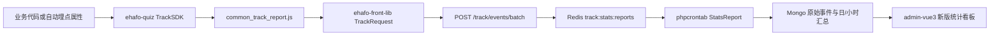

# 易哈佛前台：自研统计

自研统计是前台的关键基建，负责把页面访问、点击和业务事件送入统计分析系统。它不是 PageSpy，也不是异常日志；排查“事件有没有上报”与排查“业务请求是否报错”要分开处理。

## 链路



当前 quiz 的通用事件入口是 v2 `track/events/batch`。Python 接口只负责解析、过滤、补充 IP/时间并入队；PHP 常驻任务再建立事件关系、写入按天集合并触发汇总。不要根据公共库 README 中的旧示例反推线上地址，实际地址以 `ehafo-quiz/frontends/app/v5_src/static/js/libs/common_track_report.js` 的适配逻辑为准。

## 接入方式

优先复用已经初始化的 `window.commonTracker`，不要在业务模块里新建第二套 tracker。

```js
window.commonTracker && window.commonTracker.trackCustom('video_play', {
  track_name: '视频播放',
  video_id: videoId
})
```

常用方法：

| 方法 | 用途 |
| --- | --- |
| `trackPageView(pageId, extra)` | 页面访问 |
| `trackClick(trackId, extra, element, immediate)` | 点击事件 |
| `trackCustom(trackId, extra, immediate)` | 当前页面或业务自定义事件 |
| `trackPublic(trackId, extra, immediate)` | 跨页面复用的公共事件 |

简单点击可以使用自动埋点：元素带 `class="auto-track-click"` 和 `data-track-id`；需要展示名称、参数或跳过批量等待时再补 `data-track-name`、`data-track-params`、`data-track-immediate`。参数必须是可解析 JSON，事件 ID 应稳定、短且可在后台事件列表中检索。

## SDK 与源码位置

| 层 | 事实源 | 作用 |
| --- | --- | --- |
| 通用前端库 | [ehafo/ehafo-front-lib](https://github.com/ehafo/ehafo-front-lib)，[Codeup `ehafo/yihafo/ehafo-front-lib`](https://codeup.aliyun.com/ehafo/yihafo/ehafo-front-lib) | `src/track/base.js` 采集事件，`src/track/request.js` 处理公共参数、环境信息、批量/立即发送，`src/track/index.js` 导出 `TrackBase`、`TrackRequest`、`createTracker`；Rollup 的 `track` 入口产出 `EhafoLibTrack` UMD |
| quiz 事件层 | [ehafo/ehafo-quiz](https://github.com/ehafo/ehafo-quiz) 的 `frontends/app/v5_src/static/js/libs/new_track/` | `TrackSDK` 提供页面、点击、自定义、公共事件 API 和自动点击属性 |
| quiz 适配层 | 同仓 `frontends/app/v5_src/static/js/libs/common_track_report.js` | 加载两个前端库、填充用户/渠道/系统公共字段，把 `TrackSDK` 事件交给 `EhafoLibTrack.TrackRequest`，并设置 v2 地址 |
| 请求封装 | 同仓 `frontends/app/v5_src/static/js/core/utils/network_utils.js` | `requestTrackEventsApi` 是统一的 v2 请求封装；接口迁移测试也以此为准 |
| 接收与入队 | 同仓 `backend/client/api/track/events.py`、`backend/client/services/home_aux_service.py` | 接收 JSON 或表单的 `postdata`，过滤非法行后写入 `track:stats:reports` |
| 消费与汇总 | [ehafo/phpcrontab](https://github.com/ehafo/phpcrontab) 的 `crontab/multiProcessService/track/StatsReport.php` 及同目录汇总任务 | 事件关系、字段值、原始 Mongo 集合和日/小时数据 |
| 管理与分析 | [ehafo/admin-vue3](https://github.com/ehafo/admin-vue3) 的 `src/router/modules/independent.js` 和 `src/independentViews/track/` | 新版事件管理、事件详情、看板和图表配置 |

公共库的源仓是 `ehafo-front-lib`；quiz 中的 `new_track` 是当前业务适配/编译侧，不应把两者当成同一个文件夹维护。

后端没有另一个需要在业务代码中直接调用的“统计 SDK”；接入点就是 quiz 的 v2 路由和服务层，异步消费、存储和汇总分别在 `phpcrontab` 中完成。

## 使用与排查

线上后台：

- [新版统计看板](https://admin.ehafo.com/new_track/statistics_dashboard)
- [事件管理](https://admin.ehafo.com/new_track/event_list?hidden=1)

DEV 环境只替换为 `admin.dev.ehafo.com`，路径保持不变。看板用于按事件、属性、页面和时间范围分析；事件管理用于确认事件是否已被消费、名称和属性是否可筛选。修改事件埋点后，先在事件管理确认事件定义，再用一条真实操作验证看板数据。

遇到“代码调用了但后台没有数据”时按链路判断：

1. 浏览器控制台确认 `window.commonTracker`、`TrackSDK` 和 `EhafoLibTrack.TrackRequest` 已初始化；离线静默会话会主动跳过统计。
2. Network 查看是否请求 `track/events/batch`，检查 `postdata` 是否包含 `track_id`、`track_type`、`用户标识` 等关键字段。
3. 检查事件行是否被后端过滤：嵌套对象/数组、单值超过 64 个字符、可疑 SQL 字符串都会整行丢弃；服务端还会覆盖“发生时间”。
4. 请求成功但看板暂时没有数据时，再看 Redis 队列和 `phpcrontab` 的 `StatsReport`/汇总任务，不要直接修改前端重试逻辑。

高频踩坑：

- 事件 ID 是分析维度，不能随着文案、页面版本或临时实验名频繁变化；展示文案放 `track_name`。
- `data-track-params` 写的是 JSON 字符串，不是 JavaScript 对象字面量；父子可点击元素同时命中时，用 `data-track-stop` 或调整 DOM 边界。
- 需要记录退出、支付结果、分享成功等关键节点时使用立即上报参数；普通点击交给 SDK 批量发送。
- 统计字段新增后，前端参数、后端过滤和管理端事件关系必须一起核对；只改调用位置通常不会让后台自动出现可分析的事件。
