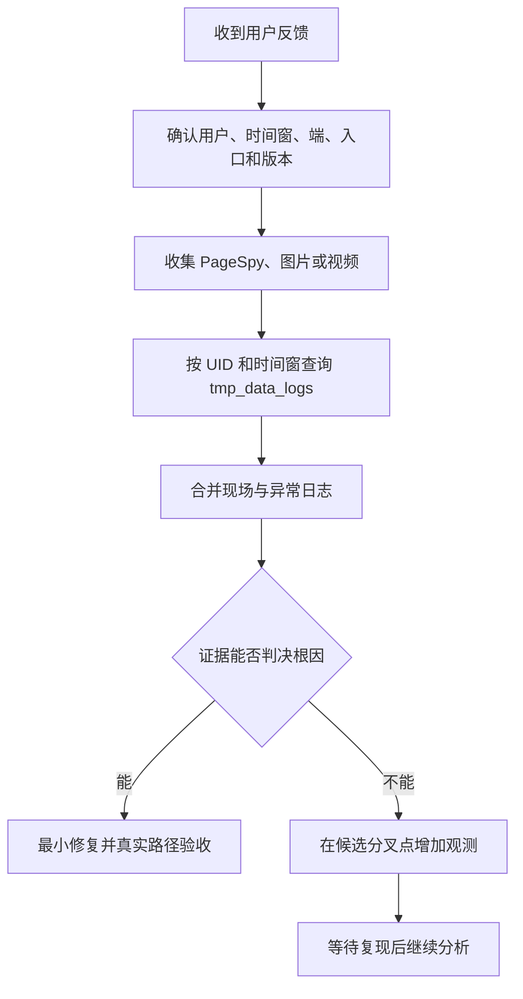

# 易哈佛前台：问题排查

本页是易哈佛前台交接的重点。目标不是记住所有源码，而是先证明用户实际运行了什么，再用现场、前端、壳层和服务端证据把问题缩到可判决的节点。

## 默认用户反馈流程

1. 根据反馈确定用户 UID、发生时间窗、[运行环境](./environment-and-device/environment.md)、[UA 与设备矩阵](./environment-and-device/ua-device.md)和可见现象；用户对原因的解释先作为假设。时间窗尽量从问题发生前后各留出少量缓冲，不要无边界查询。
2. 优先收集 PageSpy、图片和视频。在有生产权限的环境中查询线上 `kaoshi.tmp_data_logs`，用 UID 作为 `itemid`，同时限定必要的开始和结束时间；常规单用户排查不按 `model` 过滤。
3. 联合分析现场和异常日志，明确哪些是事实、哪些是推断、哪个证据缺口阻止下结论。
4. 仍无法定位时，只在最能区分候选原因的分叉点增加日志。`model` 名称不超过 20 个字符，否则会被截断。
5. 临时日志按正常源码发布流程上线；定位并完成验收后，由排查人员按同一流程清理。

PageSpy 后台为 <https://spy.dinice.cn/#/log-list>，具体操作只读 `ehafo-quiz/.codex/skills/debug-with-pagespy/SKILL.md`。完整题库 Bug 排查入口是 `ehafo-quiz/.codex/skills/debug-tiku-bug/SKILL.md`，它会继续指向当前事实源。网关案例见 `ehafo-quiz/plans/2026-08-03-new-gateway-connectivity-investigation.md`。

## 疑难问题判断框架

### 1. 先证明测试命中了目标版本

至少核对 App 包环境、入口域名、构建哈希和实际资源版本。代码已提交、CI 已成功、用户已命中新版是三个不同状态；版本没有对齐时，任何“仍然存在”或“已经修复”的结论都无效。

### 2. 按真实链路拆段

把一次操作拆成浏览器或 WebView、`ehafo-quiz` 前端、网关、后端服务、数据库和第三方依赖。每段记录输入、输出、耗时和错误；无法直接测量的网络或中间件耗时，用相邻已测节点的差值判断。

### 3. 候选原因必须能被证伪

每个候选原因都要对应一个能区分它和其他原因的观测点。例如“接口慢”不能只加总耗时，应分别记录发起前、收到响应、解析完成和页面可操作时间。没有区分力的日志只会增加噪声。

### 4. 一轮只改变一个关键变量

部署后先确认新版本生效，再比较同设备、同账号、同入口和同口径结果。不要同时调整缓存、重试、超时和网关，否则即使问题消失也无法知道原因。

### 5. 偶现问题看分布

短间隔连续采样用于观察连接复用、并发和排队；跨缓存、连接空闲或超时周期采样用于观察冷态。不要用一两次成功反驳用户反馈，也不要只看平均值。

### 6. 修复结论必须闭环

最终需要同时回答：根因是什么、证据如何排除主要替代原因、真实用户路径是否恢复、旧版和其他端是否受影响、临时观测何时清理。

## 按现象选择入口

| 现象 | 第一判断 | 使用手段或事实源 |
| --- | --- | --- |
| 普通页面、路由或接口异常 | 先在相同环境用真实登录态稳定复现 | Playwright；`ehafo-quiz/frontends/app/e2e/agent-protocol.md` |
| 微信分享、返回或样式异常 | 是否只在微信容器出现 | Agent 操控微信开发者工具走真实点击路径 |
| 远程 WebView 偶现异常 | 是否能让测试人员打开在线调试 | PageSpy skill；可实时看日志、发指令和执行 `evalJS` |
| Android 启动、恢复、原生桥异常 | Web 代码是否已部署到至少 DEV，包体环境是否匹配 | ADB；`ehafo_android_app/AGENTS.md`、`ehafo-quiz/frontends/app/e2e/offline-startup-acceptance.md` |
| MP/subproject 打不开或身份丢失 | 最终 URL、目录 `/`、`sessionid`、`_v` 和 WebView 是否正确 | [MP 与 subproject](./mp-and-subprojects.md) |
| PC 用户异常 | 实际是普通浏览器、NW.js 还是 Electron | [UA 与设备：PC 壳判断](./environment-and-device/ua-device.md#pc-壳判断)；打包仓见[仓库与系统关系](./repositories.md#pc-打包仓) |

ADB 理论上可修改包内入口连接本地地址，但证书、路由、跨域、缓存和网络可达性都会引入新变量，默认先部署远程 DEV。

## 项目特有切入点

### App 与 Web

- 包体环境、入口域名和远程资源必须一致；相同 `versionCode` 覆盖安装不一定重新解压 DCloud `www`。
- 冷启动、Splash 关闭、WebView 创建和页面可操作是不同节点，用户体验以最终可操作为准。
- 新原生能力按方法存在性探测；旧版不支持离线播放、画中画等能力时应隐藏或拒绝进入，不能报错。

### 离线资源

先核对 `uid + resourceVersion + definition` 的隔离，再检查预期大小、内容哈希和续传标识。退出登录后缓存可保留，但当前账号不能看到其他账号资源。完整启动与缓存验收见 `ehafo-quiz/frontends/app/e2e/offline-startup-acceptance.md`。

### 网关

正常请求默认允许自动重试并切换网关。排查既要确认是否完成切换，也要判断重试是否造成重复副作用；写请求尤其不能只证明“最终成功”。

### 分享海报

先区分客户端预渲染、服务端生成任务、轮询状态和截图回调四段；仓库关系见[仓库与系统关系](./repositories.md#screenshot-server)。

## 数据边界

用户 UID、PageSpy 原文、图片、视频和数据库日志可能包含敏感信息，只处理必要时间窗，不复制到本仓库，也不发送到未经允许的外部服务。
