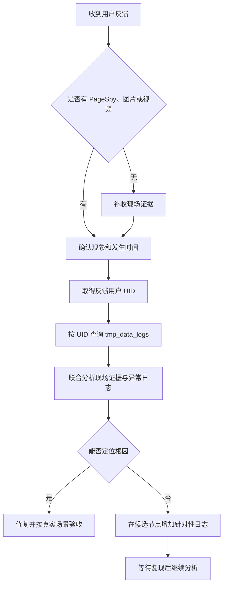

# 问题排查

## 默认流程

1. 先收集 PageSpy、图片、视频和用户描述，根据用户提供的信息确定发生时间。
2. 在有生产权限的环境中查询线上 `kaoshi.tmp_data_logs`，使用反馈用户 UID 作为 `itemid`，常规单用户排查不按 `model` 过滤。
3. 联合分析现场证据和数据库异常日志，明确区分事实、推断与证据缺口。
4. 仍无法定位时，在最能区分候选原因的节点增加一次日志上报。`model` 名称可交给 Agent 拟定，但不得超过 20 个字符，否则会被截断。
5. 临时日志按正常源码发布流程上线，问题处理完成后由排查人员按同样流程自行清理。

PageSpy 后台入口为 <https://spy.dinice.cn/#/log-list>。认证、日志下载、解码、实时指令和清理操作以 `ehafo-quiz/.codex/skills/debug-with-pagespy/SKILL.md` 为准，不在本项目重复维护。网关排查案例可参考 `ehafo-quiz/plans/2026-08-03-new-gateway-connectivity-investigation.md`。

## 调试手段

按问题逐级选择，不要求每次改动都使用全部手段。

| 手段 | 适用场景 | 前提与限制 |
| --- | --- | --- |
| 浏览器 / Playwright | 普通 Web 流程、DOM、接口、控制台、网络和重复回归 | 可用本地构建，也可访问测试环境并在 URL 中带开发用 `sessionid`。速度最快，但不能代替微信分享等特有能力 |
| 微信开发者工具 | 微信特有 API、分享、真实样式和交互 | 适合开发完成后的实际操作验收，自动化能力有限 |
| PageSpy 在线调试 | iOS 或不方便直接连接设备时的实时日志、指令和 WebView 场景 | 需要测试人员先打开在线开关；具体操作复用现有 skill |
| ADB + 可调试 App | WebView、原生桥、设备日志和网络状态需要联合分析的疑难问题 | 前端代码应先部署到远程环境，至少 DEV，并使用匹配环境的可调试包；信息最完整 |

ADB 场景理论上可以修改包内入口连接本地测试地址，但可能受证书、路由、跨域、缓存和网络可达性影响，不作为默认可靠方案。正常顺序是先用浏览器或 Playwright 快速复现，微信能力转微信开发者工具，涉及 App 壳或仍无法定位时再升级到 PageSpy 或 ADB。

## 常见切入点

### App 与 Web

- 先确认包体环境、入口域名和实际加载版本是否一致。
- 相同 `versionCode` 覆盖安装不会重新解压 DCloud `www`；壳入口变化时增加 `versionCode`，或在专用测试环境清数据、全新安装。
- 新能力按实际原生方法探测，不能只看版本号。画中画、离线播放等方法不存在时，旧版应隐藏或降级，不能报错。
- 冷启动、后台恢复、Splash 关闭和 WebView 可操作是不同信号；验收以用户真正看到可操作页面为准。
- Android 多进程问题要同时检查主进程、推送进程和后台恢复，WebView 数据目录隔离必须早于初始化。

### 离线资源

- 下载和缓存 key 使用 `uid + resourceVersion + definition` 隔离。
- `resourceVersion` 判断资源代次，`expectedBytes + contentHash` 验证文件内容，HTTP ETag / Last-Modified 用于保护续传。
- 校验失败的文件不能播放，应重新下载；版本变化可保留旧文件但标记过期。
- 退出登录后缓存保留但按 UID 隐藏，切回原账号后恢复；当前账号不能看到或播放其他账号资源。

### 网关

正常请求默认允许自动重试并切换网关，只有部分次要请求可以直接失败。当前代码只在 timeout、HTTP 408 或业务码 408 时从新网关切旧网关一次；排查时既要确认是否完成切换，也要检查重试是否造成重复副作用。

### 分享海报

- 当前主要卡片先显示客户端预渲染内容，保存或分享时才请求服务端图片；答题小结仍会等待服务端图片。
- 前端最多轮询 12 次，失败时提示稍后重试，不应阻断原业务页面。
- 服务端 `status=1` 表示生成中、`status=2` 表示可用；超过 30 秒或截图回调失败后，下一次获取会重新生成。

## 数据边界

用户 UID、PageSpy 原文、图片、视频和数据库日志可能包含敏感信息，只处理必要时间窗，不复制到本仓库，也不发送到未经允许的外部服务。
